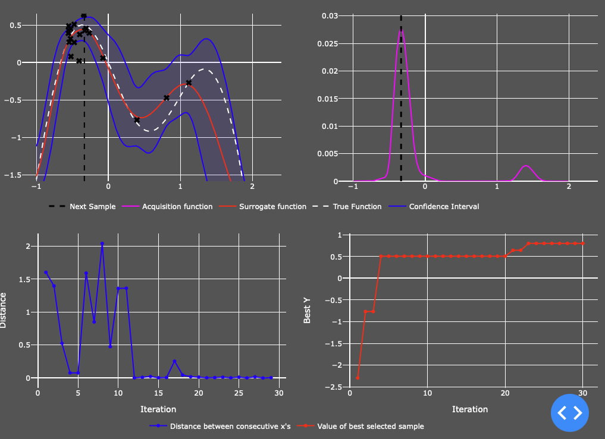

# Bayesian Optimisation
Many optimisation problems in machine learning require the optimisation of an objective function, f(x), that does not have an analytical expression and has unknown derivatives. This means evaluation of the function is restricted to sampling at a point x and getting a possibly noisy response.

If f is cheap to evaluate, we could sample at many points e.g. via grid search, random search or numeric gradient estimation. However, if function evaluation is expensive e.g. tuning hyperparameters of a neural network, drilling for oil or evaluating the effectiveness of a drug then it is important to minimise the number of samples drawn from the function f.

This is where Bayesian optimisation comes in handy! Bayesian optimization incorporates prior belief about f and updates the prior with samples drawn from f to get a posterior that better approximates f.

In Bayesian optimisation, a **surrogate function** is used to approximate the objective function (f) and a function named the **acquisition function** directs sampling of x to areas of most improvement. 

A popular surrogate function for Bayesian optimization are **Gaussian processes (GPs)**. GPs define priors over functions and can be used to incorporate prior beliefs about the objective function (smoothness, …). It is also beneficial as it is computationally cheap to evaluate.

Acquisition functions trade off exploitation and exploration. Exploitation means sampling where the surrogate model predicts a high objective returns and exploration means sampling at locations where the prediction uncertainty is high. The goal is to maximize the acquisition function to determine the next sampling point. There are numerous popular acquisition functions including; maximum probability of improvement (MPI), expected improvement (EI) and upper confidence bound (UCB).

Bayesian optimisation also uses a **kernel function** which controls the shape of the function at specific points based on distance measures between actual data observations.

## Using the dashboard

This dashboard was really an experiment with using dash and a way for me to try and improve my understanding of Bayesian optimisation. It uses the Matern kernal and Expected improvement to find the next point to sample from. (In theory!) any 1-dimensional function can be input (using *numpy*) to be optimised using the Gausian Proccess function from *sklearn*. The dashboard is initialised with the function:

After running a number of iterations the plots below are returned. 

The top left plot shows the true function and the surrogate function as well as calculated confidence intervals. The plot on the top right shows the acquisition function at a given iteration and shows where the next x sample will be drawn from. Finally the bottom two plots show the distance between the consecutive samples and the convergence of the optimal y value returned.

There’s still loads that can be adapted or added in both the front and back end so please code away!

Here’s a list of good links to better understand what’s going on!

* Martin Krasser’s [article](http://krasserm.github.io/2018/03/21/bayesian-optimization/) on Bayesian Optimisation (which inspired the functions used in the back end!)
* Philippe Remy’s [article](http://philipperemy.github.io/visualization/) which has some nice visualisations of how BO works
* A nice [article](https://machinelearningmastery.com/what-is-bayesian-optimization/) by Jason Brownlee on how to implement BO from scratch in python
* An in depth [example](https://distill.pub/2020/bayesian-optimization/) of how BO works with cool visualisations

